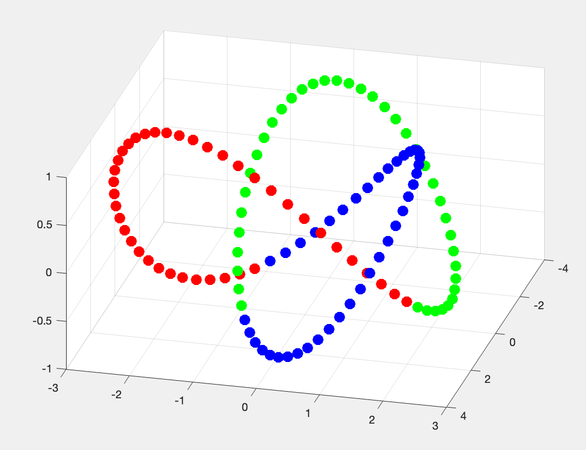
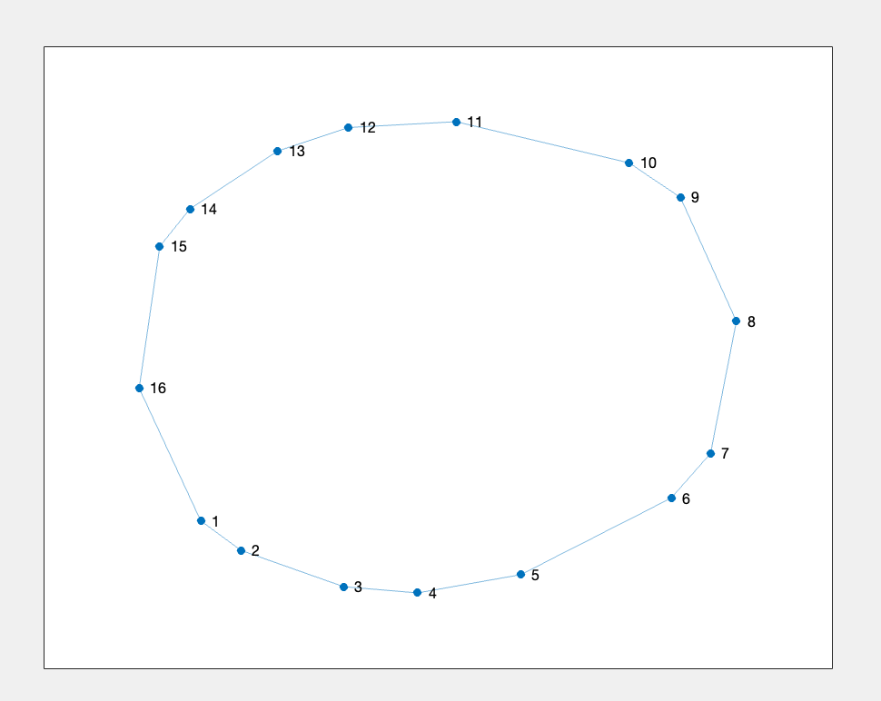
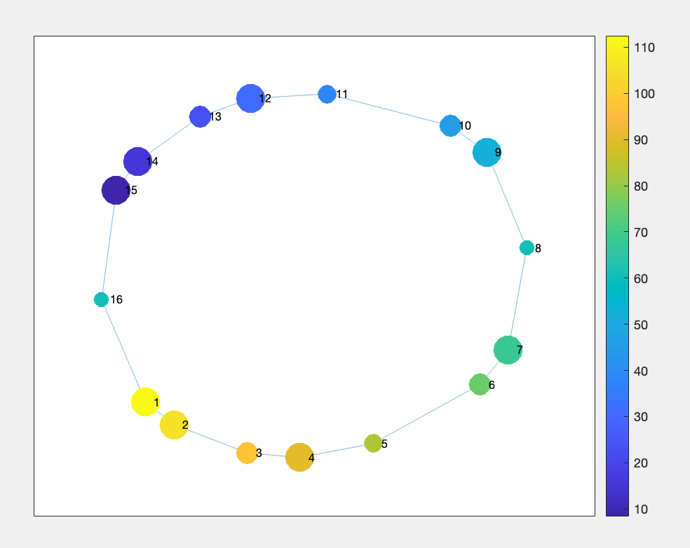
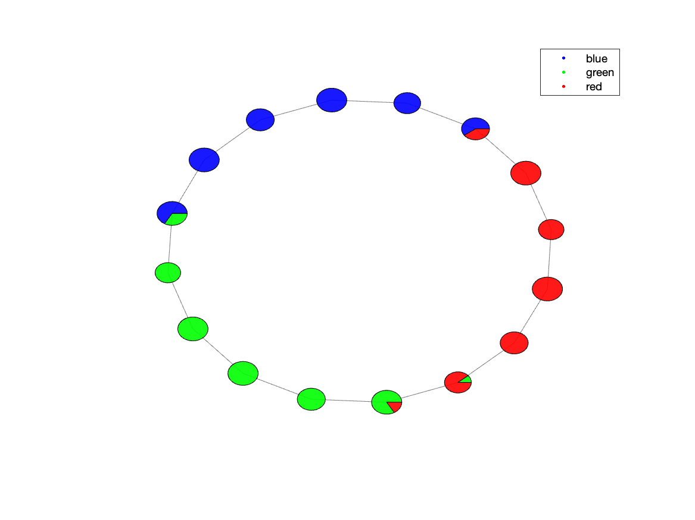
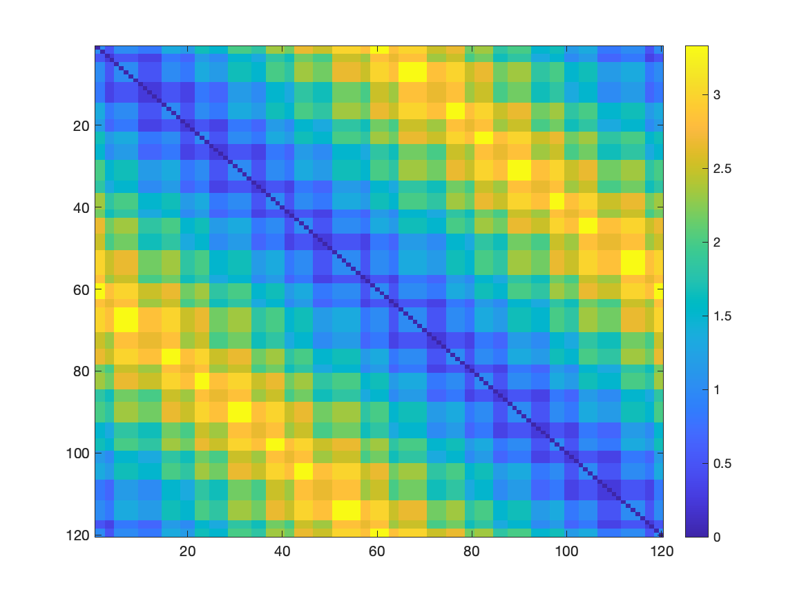

Tutorial 1: Running Mapper as a Library
================================================

All the code for this tutorial can be found in the `tutorials/tutorial1` folder. Run those files or just copy the snippets into your MATLAB environment.

============================
Step 1: Import the library
============================

To use the demapper library, you need to add the paths to the demapper files.
We need all the files within the `code` subfolder:

.. literalinclude:: ../../tutorials/tutorial1/step1_imports.m
    :language: matlab

============================
Step 2: Explore the data
============================

Load the data from the treefoil knot and explore the 3D presentation.

.. literalinclude:: ../../tutorials/tutorial1/step2_loaddata.m
    :language: matlab

Resulting image:

*Figure 2.1: Treefoil Knot data in 3D*

============================
Step 3: Run Mapper
============================

Run the following code to run a simple Mapper configuration on our dataset.

.. literalinclude:: ../../tutorials/tutorial1/step3_mapper_simple.m
    :language: matlab

What are the results, what do they look like?

.. code-block:: matlab

    res
    %   struct with fields:
    %          options: [1×1 struct]
    %        memberMat: [16×120 logical]
    %     adjacencyMat: [16×16 double]
    %      nodeMembers: {16×1 cell}
    %            knn_g: [1×1 graph]

Looks like mapper identified 16 nodes that represents the topology of the input data.
Each of the original 120 data points is a member of one or more of the nodes. The `res.memberMat` matrix represents this membership.

``memberMat``: is a logical matrix of size `numNodes x numDataPoints` where each row is a logical vector indicating which data points are members of the node

Another way to view the membership is through the nodeMembers cell array.

``nodeMembers``: cell array contains the indices of the data points that are members of each node.

.. code-block::

    res.nodeMembers
    % ans =
    %   16×1 cell array
    %     {[107 108 109 110 111 112 113 114 115 116 117 118]}
    %     {[100 101 102 103 104 105 106 107 108 109 110 111]}
    %     {[               93 94 95 96 97 98 99 100 101 102]}
    %     {[            85 86 87 88 89 90 91 92 93 94 95 96]}
    %     {[                     79 80 81 82 83 84 85 86 87]}
    %     {[                  71 72 73 74 75 76 77 78 79 80]}
    %     {[            63 64 65 66 67 68 69 70 71 72 73 74]}
    %     {[                        57 58 59 60 61 62 63 64]}
    %     {[            47 48 49 50 51 52 53 54 55 56 57 58]}
    %     {[                  41 42 43 44 45 46 47 48 49 50]}
    %     {[                     34 35 36 37 38 39 40 41 42]}
    %     {[            25 26 27 28 29 30 31 32 33 34 35 36]}
    %     {[                  19 20 21 22 23 24 25 26 27 28]}
    %     {[            10 11 12 13 14 15 16 17 18 19 20 21]}
    %     {[                   3 4 5 6 7 8 9 10 11 12 13 14]}
    %     {[                        1 2 3 4 117 118 119 120]}

Those nodes are connected to each other based on how many data points they share.
The `res.adjacencyMat` matrix represents this connectivity.

``adjacencyMat``: is a matrix of size `numNodes x numNodes` where each entry is the number of datapoints that they share.

the other field of the resulting structure are:

``options``: are the `opts` used to generate the results
``knn_g``: is the Penalized Reciprocal K-Nearest Neighbors graph of the data points used to generate the mapper. Check Hasegan et al. 2024 for more details.

==============================
Step 4: Visualize the results
==============================

To visualize the results, we can simply use the MATLAB built-in `plot` function.

.. literalinclude:: ../../tutorials/tutorial1/step4_visualize_mapper.m
    :language: matlab

The resulting figures are the following:

*Figure 4.1: Treefoil Knot data representation after Mapper*

*Figure 4.2: Treefoil Knot data representation after Mapper with node size representing the number of points withing each node; and node color representing the average point index. Based on `nodeMembers`*

.. image:: ../../tutorials/tutorial1/figure_4_3.png
  :width: 400
  :alt: Mapper graph adjacency

*Figure 4.3: Treefoil Knot data representation after Mapper with node color representing the average data point membership based on colors defined in `nodeCData` or Figure 2.1*

==============================================
Step 5: "Advanced" Visualization: `plot_task`
==============================================

An even better way to visualize the composition of the nodes regarding the points, we can use the `plot_task` utility:

.. literalinclude:: ../../tutorials/tutorial1/step5_plot_task.m
    :language: matlab

The `timing_table` needed is loaded from a CSV file containing the label for each node. The first 10 elemets of the CSV are as follows, seen using the BASH command

.. code-block:: bash

    head hasegan_et_al_netneuro_2024/data/trefoil_knot/data_treefoil_task.csv          

        task_name
        green
        green
        green
        green
        green
        green
        blue
        blue
        blue

The resulting figure is:

*Figure 5.1: Treefoil Knot data representation after Mapper with a pie chart for each node, representing its point contribution*

==============================
Step 6: Using other utilities
==============================

The library comes with a set of predefined utilities that can be used to better understand the results of Mapper outputs.

.. literalinclude:: ../../tutorials/tutorial1/step6_utils.m
    :language: matlab

Utility `compute_stats`
------------------------

**compute_stats**: computes some general statistics about the Mapper output. It generates a bunch of files as follows, as seen using the BASH commands:

.. code-block:: bash

    ls tutorials/tutorial1/stats/

        stats.json
        stats_betweenness_centrality.1D
        stats_betweenness_centrality_TRs_avg.1D
        stats_betweenness_centrality_TRs_max.1D
        stats_core_periphery.1D
        stats_core_periphery_TRs_avg.1D
        stats_core_periphery_TRs_max.1D
        stats_degrees_TRs.1D
        stats_rich_club_coeffs.1D

Specifically the `stats.json` file contains the following information:

.. code-block:: bash

    cat tutorials/tutorial1/stats/stats.json

        {
            "n_nodes" : 16,
            "coverage_nodes" : 1,
            "coverage_TRs" : 1,
            "distances_max" : 8,
            "distances_entropy" : 3.14629,
            "assortativity" : 0.238255,
            "degree_TRs_avg" : 2.83333,
            "degree_TRs_entropy" : 0.979869
        }

Those files can further be used to for other analysis or visualization. Check the file file `code/analysis/compute_stats.m` for the detailed explanation of each generated file.

Note: In case we were using a different dataset that contains fMRI data, we could generate the `hrfdur_stat` which is the autocorrelation statistic using in Hasegan et al., 2024

For generating that we would need to provide the HRF_threshold and the TR value, for example:

.. code-block:: matlab

    stats_args = struct;
    stats_args.HRF_threshold = 10;
    stats_args.TR = 2.5;

Utility `compute_temp`
------------------------

**compute_temp**: computes and plots the temporal matrices of the Mapper output. It generates the following files, as seen using the BASH commands:

.. code-block:: bash

    ls tutorials/tutorial1/tmp/

        compute_temp-TCM-mat.1D
        compute_temp-TCM.png
        compute_temp-TCM_inv-mat.1D
        compute_temp-TCM_inv.png

The Temporal Connectivity Matrix (or `TCM`) is the similarity matrix between the original points. The `TCM_inv` matrix is the inverse of the `TCM` matrix, representing the dissimilarity of original points.
Those matrices can be used as input for other analysis or visualization.

The `TCM_inv` can be seen as following:

*Figure 6.1: Dissimilarity matrix between the original points of the treefoil knot*
