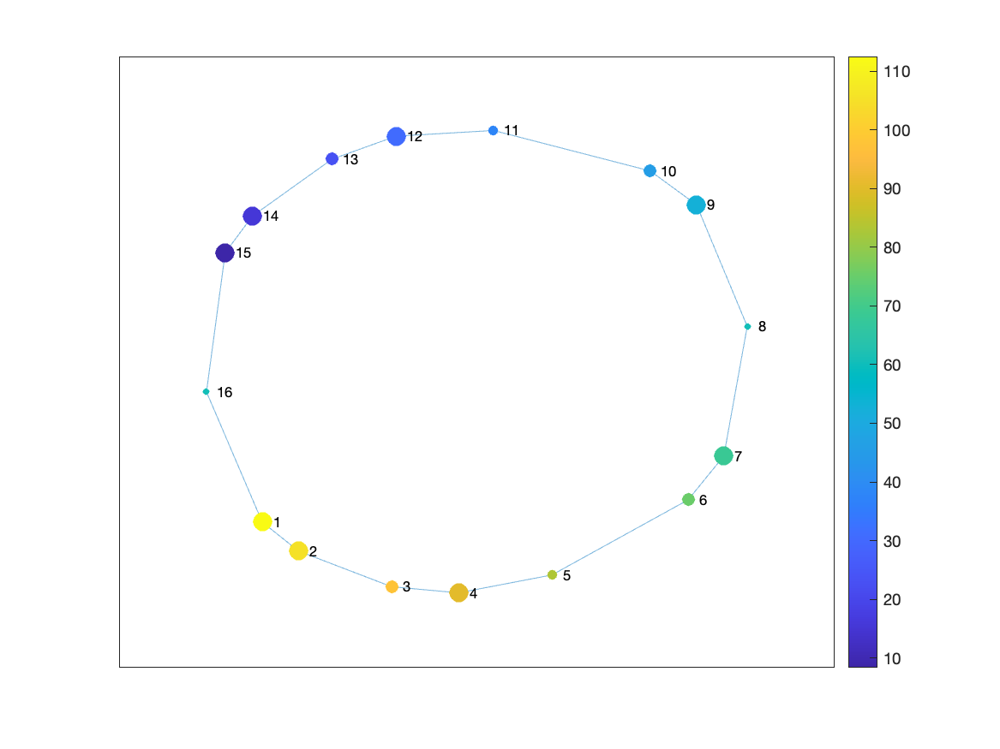
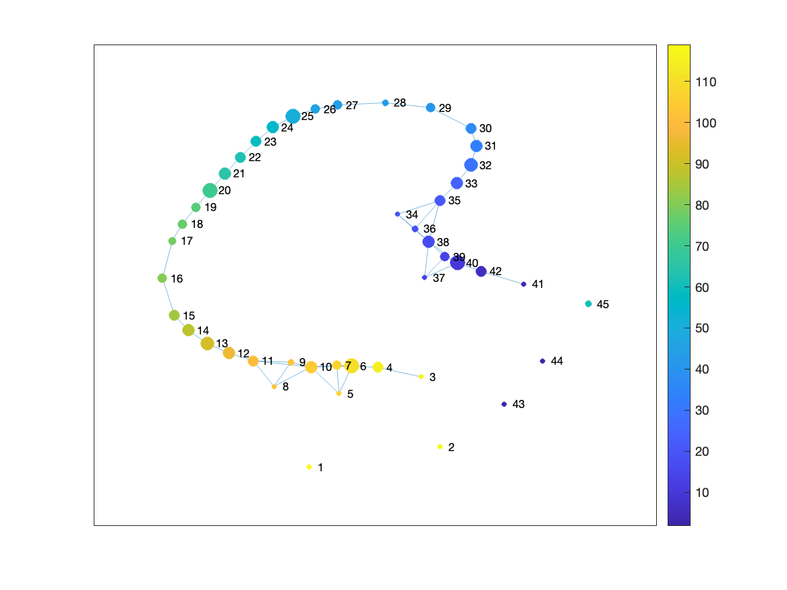
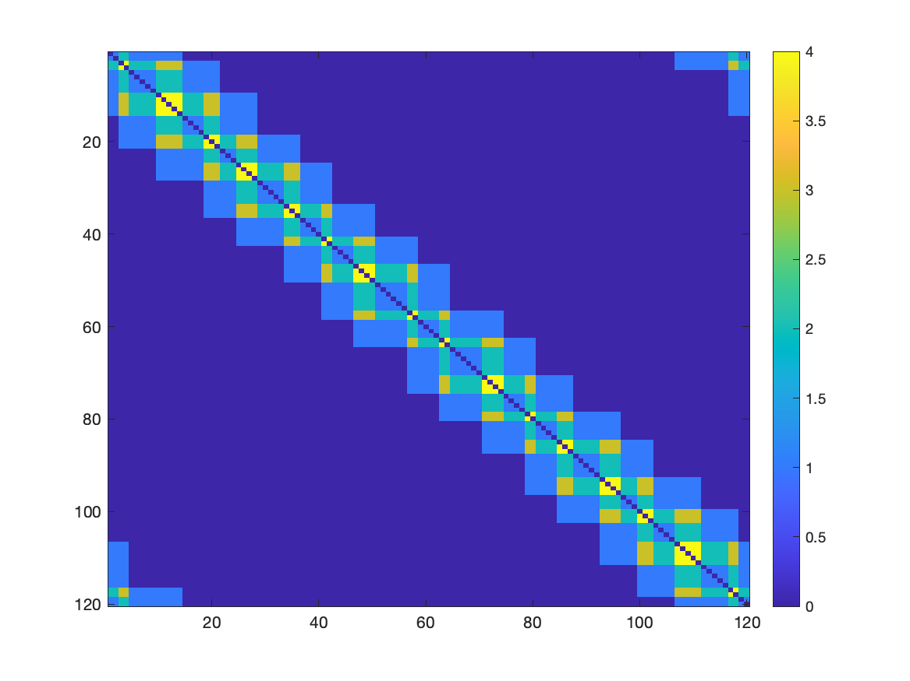

Tutorial 2: Running multiple Mappers
=====================================

In this tutorial, we will show how to run the Mapper algorithm from the command line. We will use the same data as in Tutorial 1, the trefoil knot dataset.

Our goal is to get to the following command:

.. code-block:: bash
    :caption: Target command to run the DeMapper CLI

    ARGS="cohort_csv='...';"
    ARGS="$ARGS config_path='...';"
    matlab -nodesktop -r "$ARGS run('code/analysis/run_main.m')"

The above command will run the `run_main.m` script with two arguments: `cohort_csv` and `config_path`. The `cohort_csv` argument is the path to the cohort file, and the `config_path` argument is the path to the configuration file. Further, we will build those two files.

============================
Step 1: Check the data
============================

The example data we will use for this tutorail is a trefoil knot dataset where we have 120 datapoints with 3 features each. The data is stored in a file called `data_treefoil.1D` in the `hasegan_et_al_netneuro_2024/data/trefoil_knot/` directory.

We need the data to be in the right format in order so that we process it with the DeMapper CLI.

The data has to be a 2D matrix. DeMapper CLI can load different file formats that contain the matrix, :doc:`as described here<batch_load>`.

Using BASH, we can check the contents of the trefoil knot dataset:

.. code-block:: bash

    head -n 5 hasegan_et_al_netneuro_2024/data/trefoil_knot/data_treefoil.1D
    # Output:
    # 0.0 -1.0 0.0
    # 0.2635825469361579 -0.9902526406195032 -0.15773807393743752
    # 0.5246694072399408 -0.9611307990395632 -0.31152669793339155
    # 0.7807914698042207 -0.9129938129478427 -0.4575153084753231
    # 1.0295324819206537 -0.8464360205429347 -0.5920486389876383

    wc -l hasegan_et_al_netneuro_2024/data/trefoil_knot/data_treefoil.1D  
    # Output:
    #  120 hasegan_et_al_netneuro_2024/data/trefoil_knot/data_treefoil.1D

The file has 120 rows and 3 columns separated by a space. This `1D` file is one of the correct formats supported by the DeMapper CLI.

==============================
Step 2: Create the cohort file
==============================

We want to tell the DeMapper CLI about our participants cohort. In this case, we have only 1 "participant" (the trefoil knot dataset). We will create a cohort file `cohort.csv` with the following content:

.. literalinclude:: ../../tutorials/tutorial2/cohort.csv

This will link the participant `trefoil` with the path pointing to the `data_treefoil.1D` file.

.. note::

    Note that the path is relative to the base of the DeMapper repository. When running the DeMapper CLI, the path will be resolved to the correct location. So we will have to provide a `data_root` parameter to the CLI, which will be the base of the DeMapper repository.

==============================
Step 3: Create the config file
==============================

The config file will contain the parameters for the Mapper algorithm. We will create a configuration file `mappers.json` with the following content:

.. literalinclude:: ../../tutorials/tutorial2/mappers.json

Let's break down the configuration file that will be applied for each item in the cohort file:

1. preprocess
-------------

Preprocessing will zscore the data. This is important because the Mapper algorithm is sensitive to the scale of the data. We want to make sure that the data is centered and scaled. You can check other available preprocessing options in the :doc:`preprocessing <batch_preprocessing>` section.

2. mappers
-----------

The `mappers` array will set which Mapper configurations to run. In this case, the Mapper CLI will generate 9 Mappers, with the following tags:

.. code-block::

    BDLMapperOpts_6_3_30
    BDLMapperOpts_6_3_40
    BDLMapperOpts_6_3_50
    BDLMapperOpts_6_5_30
    BDLMapperOpts_6_5_40
    BDLMapperOpts_6_5_50
    BDLMapperOpts_6_5_30
    BDLMapperOpts_6_5_40
    BDLMapperOpts_6_5_50

You can check the preset Mapper configurations in the :ref:`configuration presets section<mappers-preset>`

Alternatively, you can set all the Mapper parameters manually. We will create a more advanced mapper configuration file `mappers_adv.json` with the following content:

.. literalinclude:: ../../tutorials/tutorial2/mappers_adv.json

This configuration will generate five Mapper configurations with the distance parameter being set to either "cityblock", "euclidean", "chebychev", "correlation", or "cosine". All the other parameters are fixed to constant values defined within the :doc:`Mapper configuration<mapper>`. The following tags will be generated for this configuration, using the `name` parameter as prefix:

.. code-block::

    DistsGeoBDLMapper_cityblock
    DistsGeoBDLMapper_euclidean
    DistsGeoBDLMapper_chebychev
    DistsGeoBDLMapper_correlation
    DistsGeoBDLMapper_cosine

3. analyses
----------------

The `analyses` array will set which analyses to run. In this case, we will run the `plot_graph`, `computer_stats`, and `compute_temp` analyses. You can check other available analyses in the :doc:`analyses <batch_analysis>` section.

================================
Step 4: Running the DeMapper CLI
================================

Now that we created the cohort and configuration files, we can run the DeMapper CLI. We will use the following command, that will run at the base of the DeMapper repository. In this case, the files were created in the `tutorials/tutorial2/` directory, but feel free to create them in any directory as long as you change the paths accordingly.

Remember that in previous section on the cohort definition, we set the path to the data relative to the base of the DeMapper repository. The DeMapper CLI will resolve the path to the correct location if we provide the `data_root` parameter.

We will also provide have to provide an output directory where the results will be stored.

.. literalinclude:: ../../tutorials/tutorial2/run_mappers.sh
    :language: bash

.. note:: 
    
    MATLAB needs to have the full paths of the files to be able to run the DeMapper CLI. So we use the `pwd` BASH command to set the full path of the cohort and configuration files.

Running the above command:

.. code-block:: bash

    ./tutorials/tutorial2/run_mappers.sh
    # Output:
    # ...
    # Total mapper errors: 0

==============================
Step 5: Check the results
==============================

Lets explore the output directory to see the results of the Mapper algorithm. The output directory is defined in the `run_mappers.sh` script. In this case, the output directory is `results/tutorial2_mappers/`.

.. code-block:: bash

    ls results/tutorial2_mappers 
    # Output:
    # status.csv
    # trefoil
    cat results/tutorial2_mappers/status.csv
    # Output:
    # id0,id1,id2,mapper,preprocess,result,plot_graph,compute_stats,compute_temp
    # trefoil,,,BDLMapper_6_10_50,1,1,1,1,1
    # trefoil,,,BDLMapper_6_10_40,1,1,1,1,1
    # trefoil,,,BDLMapper_6_10_30,1,1,1,1,1
    # trefoil,,,BDLMapper_6_5_50,1,1,1,1,1
    # trefoil,,,BDLMapper_6_5_40,1,1,1,1,1
    # trefoil,,,BDLMapper_6_5_30,1,1,1,1,1
    # trefoil,,,BDLMapper_6_3_50,1,1,1,1,1
    # trefoil,,,BDLMapper_6_3_40,1,1,1,1,1
    # trefoil,,,BDLMapper_6_3_30,1,1,1,1,1

The `status.csv` file shows the status of each Mapper configuration. In this case, all the Mappers were successfully computed.

We can explore the folders generated for each Mapper configuration:

.. code-block:: bash

    ls results/tutorial2_mappers/trefoil
    # Output:
    # BDLMapper_6_10_30
    # BDLMapper_6_10_40
    # BDLMapper_6_10_50
    # BDLMapper_6_3_30
    # BDLMapper_6_3_40
    # BDLMapper_6_3_50
    # BDLMapper_6_5_30
    # BDLMapper_6_5_40
    # BDLMapper_6_5_50

    ls results/tutorial2_mappers/trefoil/BDLMapper_6_5_30/ | cat
    # Output:
    # compute_temp-TCM-mat.1D
    # compute_temp-TCM.png
    # compute_temp-TCM_inv-mat.1D
    # compute_temp-TCM_inv.png
    # plot_graph.png
    # res.mat
    # stats.json
    # stats_betweenness_centrality.1D
    # stats_betweenness_centrality_TRs_avg.1D
    # stats_betweenness_centrality_TRs_max.1D
    # stats_core_periphery.1D
    # stats_core_periphery_TRs_avg.1D
    # stats_core_periphery_TRs_max.1D
    # stats_degrees_TRs.1D
    # stats_rich_club_coeffs.1D

The DeMapper CLI generated a set of files for each Mapper configuration. For an example of the generated files, we will explore the `results/tutorial2_mappers/trefoil/BDLMapper_6_5_30/` directory. 

The `res.mat` file is generate for each Mapper configuration. The other generated files are based on the analyses we defined in the configuration file. For example, the `compute_temp` analysis generated the `compute_temp-TCM.png` and `compute_temp-TCM_inv.png` files. The `plot_graph` analysis generated the `plot_graph.png` file. Those files are detailed below

1. `res.mat` file
------------------

The `res.mat` file contains the application of Mapper. This file is the same as the one generated in :doc:`Tutorial 1<tutorial1>`. Loading it, we can generate the same Mapper graph as in the previous tutorial.

.. literalinclude:: ../../tutorials/tutorial2/step_6_1.m
    :language: matlab

The generated visualization will look like:

2. The `plot_graph` analysis
---------------------------

The `plot_graph` analysis generates a simple visualization of the Mapper graph. The visualization is saved in the `plot_graph.png` file, as seen below. 

You can observe that it's the same image as we generated with the MATLAB code above. The DeMapper CLI generated this image automatically, so now you can easily check the Mapper graph without having to run the MATLAB code. You could check all the other Mappers graphs with a simple command:

.. code-block:: bash

    open results/tutorial2_mappers/trefoil/*/plot_graph.png

You can see that some of the Mapper graphs are different. For example, one configuration failed to capture the shape of the trefoil knot as it tried to capture too much detail. 

Can you guess which Mapper configuration failed to capture the shape of the trefoil knot?

3. The `compute_stats` analysis
------------------------------

The files prefixed with `stats` are generated by the `compute_stats` analysis. The `stats.json` file contains basic statistics of the Mapper graph.

.. code-block:: bash

    cat results/tutorial2_mappers/trefoil/BDLMapper_6_5_30/stats.json
    # Output:
    # {
    #     "n_nodes" : 16,
    #     "coverage_nodes" : 1,
    #     "coverage_TRs" : 1,
    #     "distances_max" : 8,
    #     "distances_entropy" : 3.14629,
    #     "assortativity" : 0.238255,
    #     "degree_TRs_avg" : 2.83333,
    #     "degree_TRs_entropy" : 0.979869
    # }

Check the `code/analysis/compute_stats.m` file for the definition of the statistics generated. The `compute_stats` analysis is useful to understand the properties of the Mapper graph. Since it is generated for each configuration, you can compare the Mapper graphs based on the statistics.

4. The `compute_temp` analysis
-----------------------------

The `compute_temp` analysis generates the temporal connectivity matrix (TCM) and its inverse. The TCM is the similarity matrix between the original points. The `TCM_inv` matrix is the inverse of the `TCM` matrix, representing the dissimilarity of original points. Those matrices can be used as input for other analysis or visualization.

You can observe that each datapoint from the original dataset is similar to the other points in the neighborhood. The `compute_temp` analysis is useful to understand the similarity between the original points and how they are connected in the Mapper graph.

======================================
Step 6: Advanced Mapper configurations
======================================

Similarly, you could run the advanced Mapper configuration file `mappers_adv.json`. 

.. literalinclude:: ../../tutorials/tutorial2/run_mappers_adv.sh
    :language: bash

Running the above command:

.. code-block:: bash

    ./tutorials/tutorial2/run_mappers_adv.sh
    # Output:
    # ...
    # Total mapper errors: 0

The results will be stored in the `results/tutorial2_mappers_adv/` directory. You can explore the results as we did before.
